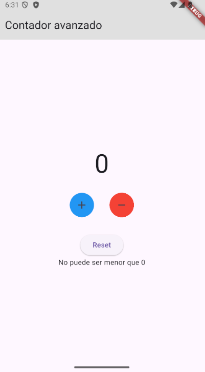

# contador_con_limites_y_validacion

# Contador Avanzado – Flutter

## Qué hace

- Incrementa y decrementa un contador
- Botón de reset para volver a 0
- No permite valores menores que 0 ni mayores que 20
- Muestra mensaje dinámico cuando se alcanza un límite

## Conceptos aprendidos

- `setState` para actualizar UI
- Validaciones y condiciones antes de actualizar estado
- Uso de Row, Column, IconButton y ElevatedButton
- Mensajes dinámicos en pantalla

## Captura

